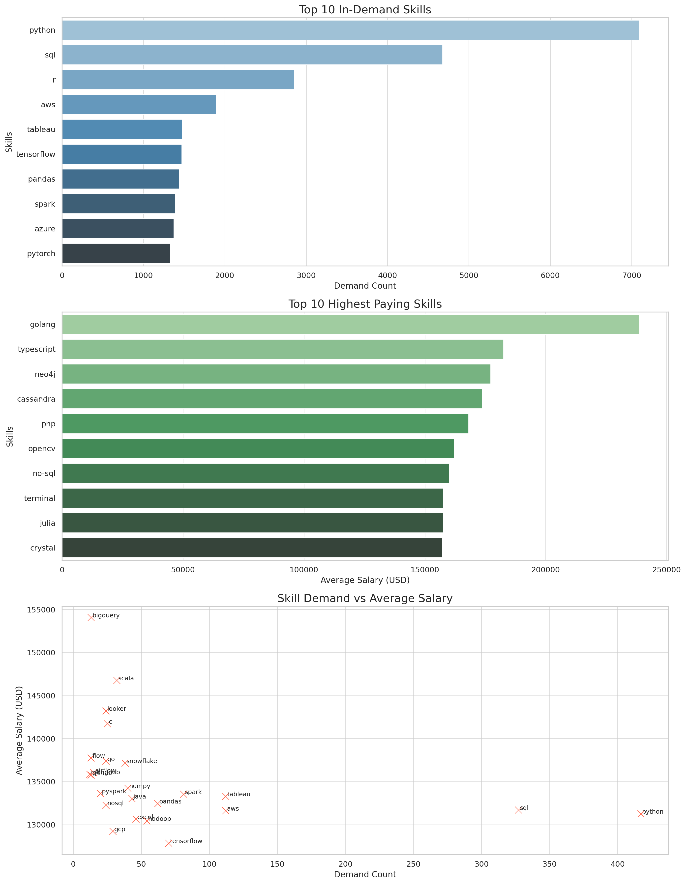

# Introduction 

Welcome to the world of data jobs, where SQL meets salary insights! This project dives deep into the ever-evolving landscape of Data Science, Machine Learning, and AI careers. Using a collection of powerful [SQL scripts](./project_sql/), we uncover which skills pay the most, which technologies are trending, and what it really takes to land a top-paying role in the data industry. Curious about the code? Check out the [project_sql](./project_sql/)  folder to explore the queries yourself! Whether you're a job seeker, a tech enthusiast, or just love a good data story, you'll find plenty of insights (and maybe a few surprises) inside!

# Background

As someone interested in landing a role in Data Science, Machine Learning, or AI, I wanted to go beyond generic job advice and really understand what it takes to stand out. With so many job titles—like Data Scientist, AI Engineer, Machine Learning Engineer, and more—I was curious: **What are the most valuable skills and requirements for these positions?** And just as importantly, **how do those skills translate into salary?**

To find the answer to these questions I devided it into 5 main questions and answered each:
1. What are the. top paying jobs in this field?
2. What skills are required for top paying jobs?
3. What skills are most in demand for these jobs?
4. Which skills are associated with higher salaries?
5. What are the most optimal skills to learn?

# Tools I used
- **SQL**: The backbone of this project, allowing me query the database and reach critical conclusions.
- **Postgresql**: Chosen DBM system
- **VSC**
- **Git and Github**

# Conclusions

- High-demand skills like Python, SQL, and R dominate the job market but don’t always command the highest salaries.

- High-paying skills such as Golang, TypeScript, and Neo4j are less in demand but offer premium compensation, likely due to specialization or scarcity.

- Ideal skills lie in the balance—like Spark, AWS, and Tableau—where demand and salary are both relatively strong. These are solid choices for career growth.

